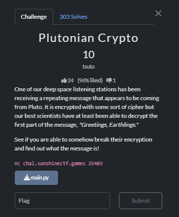

## Write-up for Plutonian Crypto made by NEMO246

#### Одна из наших станций дальней космической связи получила повторяющееся сообщение, которое, вероятно приходит с Плутона. Оно зашифровано каким-то шифром, но наши лучшие ученые смогли расшифровать только первую часть сообщения, "Приветствуем, Земляне" (ориг. "Greetings, Earthlings.")

#### Посмотрите, можете ли вы как нибудь взломать их шифр и выяснить что находится в сообщении!

## Решение [`solve.py`](solve.py)
[`main.py`](main.py)
